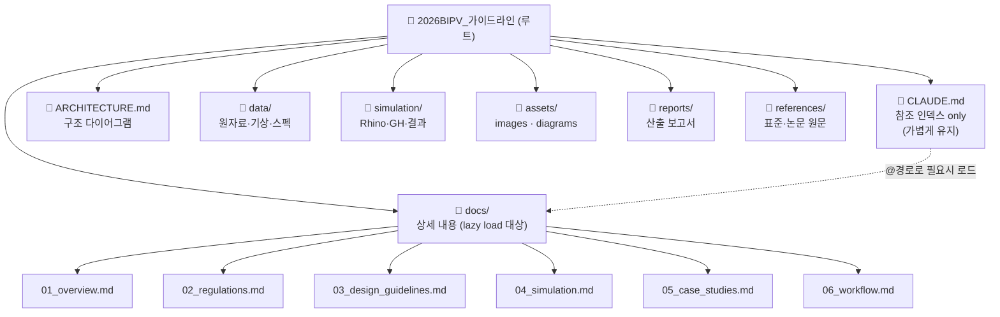
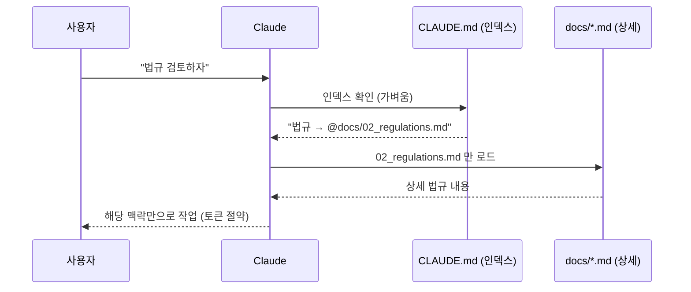
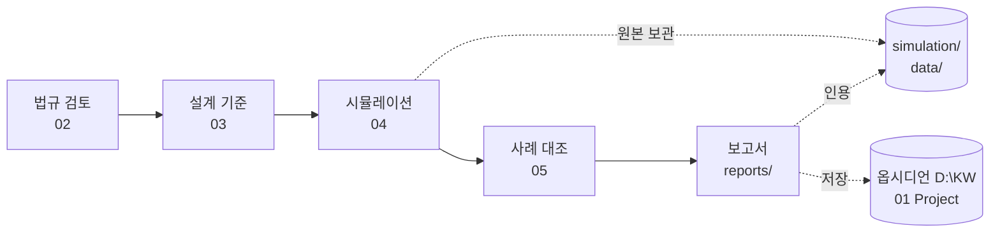
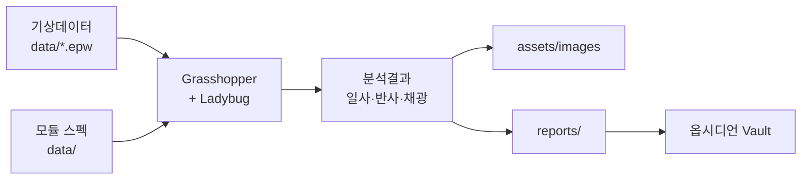

# 프로젝트 아키텍처 — 2026 BIPV 가이드라인

## 1. 전체 구조 (Lazy Loading 컨셉)

```mermaid
graph TD
    ROOT["📁 2026BIPV_가이드라인 (루트)"]
    CLAUDE["📄 CLAUDE.md<br/>참조 인덱스 only<br/>(가볍게 유지)"]
    ARCH["📄 ARCHITECTURE.md<br/>구조 다이어그램"]

    ROOT --> CLAUDE
    ROOT --> ARCH
    ROOT --> DOCS["📂 docs/<br/>상세 내용 (lazy load 대상)"]
    ROOT --> DATA["📂 data/<br/>원자료·기상·스펙"]
    ROOT --> SIM["📂 simulation/<br/>Rhino·GH·결과"]
    ROOT --> ASSETS["📂 assets/<br/>images · diagrams"]
    ROOT --> REPORTS["📂 reports/<br/>산출 보고서"]
    ROOT --> REFS["📂 references/<br/>표준·논문 원문"]

    CLAUDE -. "@경로로 필요시 로드" .-> DOCS

    DOCS --> D1["01_overview.md"]
    DOCS --> D2["02_regulations.md"]
    DOCS --> D3["03_design_guidelines.md"]
    DOCS --> D4["04_simulation.md"]
    DOCS --> D5["05_case_studies.md"]
    DOCS --> D6["06_workflow.md"]
```

## 2. Lazy Loading 동작 원리

```mermaid
sequenceDiagram
    participant U as 사용자
    participant C as Claude
    participant R as CLAUDE.md (인덱스)
    participant D as docs/*.md (상세)

    U->>C: "법규 검토하자"
    C->>R: 인덱스 확인 (가벼움)
    R-->>C: "법규 → @docs/02_regulations.md"
    C->>D: 02_regulations.md 만 로드
    D-->>C: 상세 법규 내용
    C-->>U: 해당 맥락만으로 작업 (토큰 절약)
```

## 3. 작업 파이프라인

```mermaid
flowchart LR
    A["법규 검토<br/>02"] --> B["설계 기준<br/>03"]
    B --> C["시뮬레이션<br/>04"]
    C --> D["사례 대조<br/>05"]
    D --> E["보고서<br/>reports/"]
    C -. 원본 보관 .-> S[("simulation/<br/>data/")]
    E -. 인용 .-> S
    E -. 저장 .-> O[("옵시디언 D:\KW<br/>01 Project")]
```

## 4. 데이터 흐름

```mermaid
graph LR
    EPW["기상데이터<br/>data/*.epw"] --> GH["Grasshopper<br/>+ Ladybug"]
    SPEC["모듈 스펙<br/>data/"] --> GH
    GH --> RES["분석결과<br/>일사·반사·채광"]
    RES --> IMG["assets/images"]
    RES --> REP["reports/"]
    REP --> OBS["옵시디언 Vault"]
```

> 다이어그램은 GitHub·Obsidian·VS Code(Mermaid 확장)에서 렌더링됩니다.
